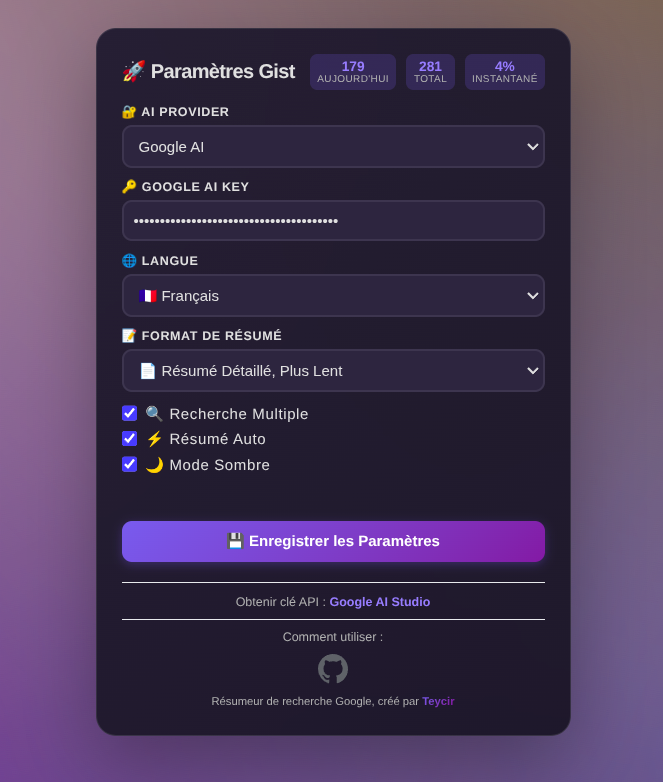

# Gist 🚀

[](https://youtu.be/QSYSyI-Zo2o)

## What is Gist?

**Gist** saves you time when searching online. Instead of opening 10 different websites and reading long articles, Gist reads them for you and gives you a short summary in seconds.

Think of it as your personal reading assistant that lives in your browser. Everything stays on your computer — no tracking, no data collection, no ads. Fully open-source. Save and organise all your summaries for later use.

<p align="center">
  
</p>

### ✨ What Can Gist Do?

- 🔑 **Free to Use** — Get free summaries every day using OpenRouter's free model tier
- 🔒 **Your Privacy is Safe** — Everything stays on your computer, no tracking
- ⚡ **Super Fast** — Brief answers in seconds; expand any brief summary into a detailed one
- 🔍 **Works Everywhere** — Google and DuckDuckGo
- 🌍 **Speaks Your Language** — English, Spanish, French, and German
- 📝 **Choose Your Style** — Quick summary (~500 words) or detailed explanation (~2000 words)
- 🔗 **Shows Sources** — Every summary includes clickable links to the websites used
- 💾 **Save for Later** — Download as `.md`, save to history with tags and favourites
- 📋 **Easy Sharing** — Share on X (Twitter), LinkedIn, or email
- 💬 **Ask Follow-up Questions** — Chat with the AI about any summary
- 🔄 **Multi-Search** — Search Google and DuckDuckGo simultaneously, auto-summaries for each
- ⌨️ **Keyboard Shortcut** — `Ctrl+Shift+S` / `Cmd+Shift+S` for instant summaries
- 📊 **Usage Stats** — Privacy-preserving local stats: total summaries, cache hits, tokens used

---

## How it Works

```
User searches on Google / DuckDuckGo
        ↓
Gist injects a "Summarize" button into the results page
        ↓
User clicks the button (or presses Ctrl+Shift+S)
        ↓
Extension scrapes the top result URLs
        ↓
Pages are fetched in parallel, HTML is stripped to clean text
        ↓
Cache check — instant result if previously summarised
        ↓
OpenRouter API called with cleaned content + user prompt
        ↓
Markdown response rendered in a floating overlay with source links
```

**Performance targets (verified by test suite):**

| Operation | Target | Typical |
|-----------|--------|---------|
| Cold start (no cache) | < 8 s | ~5–7 s |
| Warm cache | < 100 ms | ~50 ms |
| URL scraping | < 5 ms | ~2 ms |
| HTML cleaning | < 10 ms / page | ~5 ms |
| Cache key generation | < 1 ms | ~0.1 ms |

---

## Why Gist Instead of Google's AI Overviews?

**🎯 Control**
- Summarises only when YOU ask — not forced on every search
- Choose Brief or Detailed format
- Choose your output language
- Works on DuckDuckGo too

**💾 Save & Organise**
- Download summaries as `.md` files
- One-click copy to clipboard
- Full searchable history with tags and favourites

**🔗 Source Transparency**
- Every summary links to the 3 pages it read
- Click any source to verify or cite it

**💬 Follow-up Chat**
- Ask the AI to explain anything in the summary
- Answers stay grounded in what was actually read

**🔒 Privacy**
- Nothing leaves your device except the OpenRouter API call
- No backend servers, no analytics, no ads
- Open-source — read the code yourself

---

## Who Should Use Gist?

| Audience | Use case |
|----------|----------|
| 🔒 Privacy-conscious users | No tracking, no servers, BYOK |
| 👨‍🎓 Students | Fast research, multi-language summaries, citable sources |
| 💼 Professionals | Industry news in minutes, shareable findings |
| 🌍 Language learners | Search in one language, read summary in another |
| 📰 News readers | Compare perspectives across sources |
| 🔍 Curious people | Fast answers without ads or paywalls |

---

## Getting Started

### Step 1 — Install (2 minutes)

1. Open Chrome and go to `chrome://extensions/`
2. Enable **Developer mode** (top-right toggle)
3. Click **Load unpacked** and select the `dist` folder
4. The Gist icon appears in your toolbar

### Step 2 — Get a Free API Key (1 minute)

1. Go to [openrouter.ai/keys](https://openrouter.ai/keys)
2. Sign up (free) and create an API key
3. Click the Gist icon → paste your key → **Save Settings**

Gist automatically selects the best available free model (e.g. `meta-llama/llama-3.2-3b-instruct:free`) and keeps fallbacks ready.

### Step 3 — Summarise

1. Search anything on Google or DuckDuckGo
2. Click the coloured button on the right of the results (or press `Ctrl+Shift+S`)
3. Read your summary in seconds

---

## Features

### Summary Formats
- **Brief** — 3–5 bullet points, ~500 words. Best for quick lookups.
- **Detailed** — Full breakdown with context, ~2000 words.
- **Key Points** — Structured list of the most important facts.

Every format includes clickable source links at the bottom.

### Languages
Gist supports 4 output languages regardless of the search language:

| Language | Code |
|----------|------|
| 🇺🇸 English | `English` |
| 🇪🇸 Spanish | `Spanish` |
| 🇫🇷 French | `French` |
| 🇩🇪 German | `German` |

**Tip:** Search in English, get the summary in French. Works across any combination.

### Multi-Search
Enable in settings to open Google and DuckDuckGo side-by-side, each with its own automatic summary. Useful when you want broader coverage or a second opinion.

### History & Organisation
- All summaries saved locally in your browser
- Search by keyword across your entire history
- Tag summaries (e.g. `work`, `thesis`, `recipes`)
- Filter by one or multiple tags simultaneously
- Star favourites for instant retrieval
- Delete individual entries or reset all history

### Usage Stats
Gist tracks a small set of privacy-preserving local counters visible in the popup:
- Total summaries generated
- Cache hit count (times a repeated search was served instantly)
- Approximate tokens used
- Last reset date

No data ever leaves your device.

### Dark Mode
Toggle in settings. All overlays and popups switch to a dark colour scheme.

### Keyboard Shortcut
`Ctrl+Shift+S` on Windows/Linux — `Cmd+Shift+S` on Mac — triggers a summary from anywhere on a supported results page.

---

## Architecture

Gist is a **fully client-side Chrome extension** — no backend, no servers, no database.

```
manifest.json
├── content/
│   ├── content.js          — Core logic: scraping, fetching, caching, API calls, UI
│   ├── content-critical.css — Critical CSS loaded inline
│   └── content.min.css     — Full stylesheet (lazy-loaded)
├── popup/
│   ├── popup.html          — Settings UI
│   └── popup.js            — Config management, model loading, usage stats
├── lib/
│   ├── model-selector.js   — Scores and ranks free OpenRouter models; exposes
│   │                         window.selectBestModels / window.selectBestGeminiModels
│   └── html-cleaner.js     — HTML → plain text pipeline
├── workers/
│   └── markdown-worker.js  — Off-main-thread Markdown → HTML rendering
└── background.js           — Service worker: multi-search tab management
```

### Storage layout (`chrome.storage.local`)

```javascript
{
  openrouterApiKey: string,        // User's OpenRouter key
  openrouterPrimaryModel: string,  // Auto-selected best free model
  openrouterFallbackModels: string[], // Ordered fallback list
  selectedLanguage: string,        // 'English' | 'Spanish' | 'French' | 'German'
  summaryFormat: string,           // 'brief' | 'detailed' | 'keyPoints'
  selectedModel: string,           // Current active model ID
  multiSearchEnabled: boolean,
  darkMode: boolean,
  usageStats: {
    totalSummaries: number,
    cacheHits: number,
    totalTokens: number,
    lastReset: number,
  },
  "summary_<hash>": {              // Cached summary entry
    markdown: string,
    urls: string[],
    timestamp: number,
  },
  "page_<hash>": {                 // Cached page content
    content: string,
    timestamp: number,
  }
}
```

### Model selection (`lib/model-selector.js`)

On first use (or when no model is stored), Gist fetches the live model list from OpenRouter and scores every free model by context window size, provider reliability, and a provider bonus for known-good routes. The top result becomes the primary model; the next three are kept as fallbacks. Both functions are exposed on `window` so `content.js` can call them without an import graph.

---

## Development

```bash
# Install dependencies
npm install

# Run tests
npm test

# Run tests with coverage report
npm run test:coverage

# Build for production (minified)
npm run build

# Optimised production build
npm run build:optimized

# Watch mode (auto-rebuild on save)
npm run watch
```

### Test suite

18 test files, 131 tests covering:
- URL scraping and engine detection
- HTML cleaning pipeline
- Caching (key generation, hits, invalidation)
- Summarisation flow (brief, detailed, key-points formats)
- Multi-search
- Model selection and fallback logic
- Edge cases (empty results, paywalled pages, missing API key)
- Performance benchmarks (cold start, warm cache, parallel fetch)
- Usage stats tracking
- Popup settings persistence

---

## Common Questions

**Q: Is it really free?**
OpenRouter offers free model tiers — Gist uses those automatically. No payment required.

**Q: Is my data safe?**
Your API key and all summaries are stored only in your browser's local storage. The only external call is to `openrouter.ai` with the page content to summarise.

**Q: What model does it use?**
Gist auto-selects the highest-scoring free model available on OpenRouter at setup time (typically `meta-llama/llama-3.2-3b-instruct:free`) and refreshes this choice when you save settings.

**Q: Can I use it on mobile?**
Not yet — Chrome extensions only run on desktop Chrome.

**Q: How do I clear my history?**
Click the history button (📚) → trash icon (🗑️) to delete all or individual entries.

**Q: Why does Gist need its own API key instead of a shared one?**
A shared key would mean all users share a single rate limit, which doesn't scale. With your own key, your usage is independent and the connection goes directly from your browser to OpenRouter — no Gist servers involved.

---

## Troubleshooting

| Problem | Fix |
|---------|-----|
| "No API key found" | Open the Gist popup and save your OpenRouter key |
| Button doesn't appear | Refresh the page; confirm you're on a Google or DuckDuckGo results page |
| Summary takes very long | Switch to Brief format; check your internet connection |
| "Could not extract content" | The target site blocks scraping — try rephrasing the search |
| "API error" | Verify your key at [openrouter.ai](https://openrouter.ai); you may have hit a free-tier rate limit |
| Summary is empty | Make sure the search returned actual results, not a "did you mean" page |

---

## Privacy

| What Gist does NOT do | What Gist DOES do |
|----------------------|-------------------|
| ❌ Collect search history | ✅ Store your key locally in your own browser |
| ❌ Track what you summarise | ✅ Save summaries only on your device |
| ❌ Send data to any Gist servers | ✅ Call OpenRouter directly from your browser |
| ❌ Sell your information | ✅ Keep usage stats locally, never transmitted |
| ❌ Show ads | ✅ Open-source — read every line at [github.com/Teycir/Gist](https://github.com/Teycir/Gist) |

---

## Contributing

1. Fork the repo
2. Create a feature branch (`git checkout -b feature/my-feature`)
3. Make your changes and add tests where applicable
4. Run `npm run test:coverage` — all 131 tests must pass and coverage thresholds must be met
5. Submit a pull request

Bug reports and feature requests welcome via [GitHub Issues](https://github.com/Teycir/Gist/issues).

---

<!-- related-projects:start -->
## 🌐 Related Projects

More privacy-first and security tools by the same author:

### Privacy & Communication
- **[GhostChat](https://github.com/Teycir/GhostChat)** — True P2P encrypted chat via WebRTC. No servers, no storage, self-destructing messages.
- **[Sanctum](https://github.com/Teycir/Sanctum)** — Zero-trust encrypted vault with cryptographic plausible deniability (XChaCha20-Poly1305, Argon2id).
- **[Timeseal](https://github.com/Teycir/Timeseal)** — Time-locked encryption vault with Dead Man's Switch. AES-256 split-key crypto.
- **[GhostReceipt](https://github.com/Teycir/GhostReceipt)** — Anonymous receipt generation with zero-knowledge proofs.
- **[xmrproof](https://github.com/Teycir/xmrproof)** — Monero payment verification, 100% client-side.

### Research & Productivity
- **[ArxivExplorer](https://github.com/Teycir/ArxivExplorer)** — Fast semantic CS arXiv search with AI summaries. Understand any paper in 60 seconds.
- **[SeekYou](https://github.com/Teycir/SeekYou)** — Host intelligence aggregator — unified OSINT across 15 sources for IPs, domains, and ASNs.
- **[CheckAPI](https://github.com/Teycir/CheckAPI)** — LLM API key validator for multiple providers. Privacy-first, client-side validation.

### Security Tools
- **[BurpAPISecuritySuite](https://github.com/Teycir/BurpAPISecuritySuite)** — Burp Suite extension for API security testing. 15 attack types, 108+ payloads, BOLA/IDOR detection.
- **[Mcpwn](https://github.com/Teycir/Mcpwn)** — Automated security scanner for Model Context Protocol servers. Detects RCE, path traversal, prompt injection.
- **[DiffCatcher](https://github.com/Teycir/DiffCatcher)** — Git repo discovery, diff capture, and code element extraction.
- **[HoneypotScan](https://github.com/Teycir/HoneypotScan)** — Honeypot detection service for security research.
<!-- related-projects:end -->

---

<!-- services:start -->
## 💼 Services

- 🔒 **Privacy-First Development** — P2P apps, encrypted communication, zero-knowledge systems
- 🚀 **Web Application Development** — Full-stack with Next.js, React, TypeScript
- 🔧 **Extension Development** — Chrome/Firefox extensions, content scripts, service workers
- 🛡️ **Security Tool Development** — Burp extensions, penetration testing tools, automation
- 🤖 **AI Integration** — LLM-powered applications, prompt engineering, model routing
- 🔍 **OSINT & Threat Intelligence** — Custom recon tools, threat feed aggregation

**Contact:** [teycirbensoltane.tn](https://teycirbensoltane.tn) — available for freelance and consulting
<!-- services:end -->

---

<!-- attribution:start -->
<div align="center">

**Made with ❤️ for people who value their time**

Built by [Teycir Ben Soltane](https://teycirbensoltane.tn)

</div>
<!-- attribution:end -->

---

<!-- donation:eth:start -->
<div align="center">

## Support Development

If Gist saves you time, consider supporting ongoing development.

**ETH Donation Wallet**
`0x11282eE5726B3370c8B480e321b3B2aA13686582`

<a href="https://etherscan.io/address/0x11282eE5726B3370c8B480e321b3B2aA13686582">
  
</a>

_Scan the QR or copy the address — every contribution helps keep Gist free._

</div>
<!-- donation:eth:end -->

---

*Developer docs: [docs/architecture.md](docs/architecture.md)*
