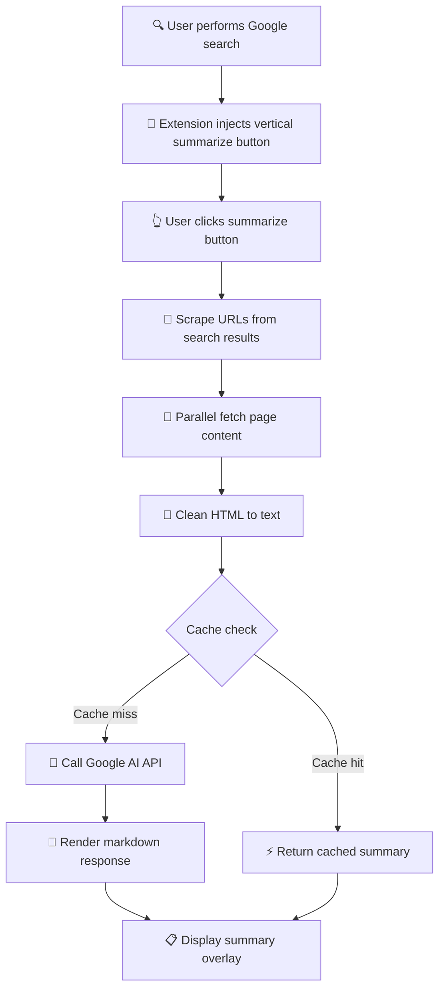

# Gist 🚀

## What is Gist?

**Gist** is a Chrome extension that transforms how you consume Google search results by providing instant AI-powered summaries. Instead of clicking through multiple websites and reading lengthy articles, get a comprehensive summary of the top search results in seconds.

**Real-World Benefits:**
- **Save 10+ minutes per search** - No more tab overload from opening 5-10 articles
- **Research faster** - Students and professionals get comprehensive answers instantly
- **Break language barriers** - Search in any language, get summaries in another (e.g., German articles → English summary)
- **Share instantly** - One-click sharing to X, LinkedIn, or email with formatted content
- **Copy with formatting** - Preserve markdown formatting for social media posts and documents
- **Stay informed** - Quickly catch up on news, tech updates, or trending topics
- **Learn efficiently** - Understand complex topics without reading multiple long-form articles
- **Make better decisions** - Compare multiple sources in one consolidated summary

### Why Choose Gist Over Google's Native AI Summaries?

**🎯 More Control & Customization**
- **Choose Your Summary Style**: Brief for quick scans, Detailed for deep research, or Key Points for instant answers
  - *Google's AI*: One-size-fits-all summaries, no customization
  - *Gist*: 3 formats tailored to your needs
- **Multilingual Flexibility**: Access foreign language sources in your language - for example, German articles summarized in English
  - *Google's AI*: Can't read foreign sources, summaries only in search language
  - *Gist*: Read any language source, get summaries in your preferred language
- **Your Own API Key**: 1500 free requests/day, no hidden limits
  - *Google's AI*: Unknown rate limits, can disappear without notice
  - *Gist*: You control your quota and costs

**🔒 Privacy & Transparency**
- **100% Open Source**: Inspect every line of code - no hidden tracking
  - *Google's AI*: Closed source, unknown data collection
  - *Gist*: Fully transparent on GitHub
- **Zero Data Collection**: Your searches stay private, never logged or analyzed
  - *Google's AI*: Likely used for training and profiling
  - *Gist*: No servers, no tracking, no telemetry
- **Local Processing**: API key stored only in your browser
  - *Google's AI*: All data passes through Google's servers
  - *Gist*: Direct API connection, no middleman

**⚡ Performance & Reliability**
- **Smart Caching**: Repeated searches load in <100ms - instant results
  - *Google's AI*: Regenerates every time, slower
  - *Gist*: Intelligent caching saves time and API calls
- **Offline-Ready**: Access cached summaries without internet
  - *Google's AI*: Requires internet connection always
  - *Gist*: Works offline for previously searched topics
- **Always Available**: Works on every Google search, every time
  - *Google's AI*: Only appears for select queries
  - *Gist*: You decide when to summarize, not Google

### How to Use Gist

**Step 1: Install & Configure**
1. Install the extension from Chrome Web Store or load unpacked
2. Click the Gist icon in your browser toolbar
3. Get a free API key from [Google AI Studio](https://aistudio.google.com/app/apikey)
4. Paste your API key and select your preferences
5. Choose your preferred language and summary format

**Step 2: Summarize Any Search**
- **Method 1**: Click the vertical button on the right side of any Google search page
- **Method 2**: Press `Ctrl+Shift+S` (or `Cmd+Shift+S` on Mac)
- Wait 3-5 seconds for the AI to analyze the top 3 search results
- View your summary in a beautiful popup with source references

**Step 3: Customize Your Experience**
- **Change Languages**: Search in English, get summaries in Spanish, French, or German
- **Switch Formats**: 
  - 🎯 **Brief** (3-5 bullet points, ~500 words, fastest)
  - 📄 **Detailed** (comprehensive analysis, ~2000 words, slowest)
  - ⚡ **Key Points** (essential takeaways only, ~250 words, ultra-fast)
- **Share Results**: Use the share button to post on X (Twitter), LinkedIn, or email
- **Copy to Clipboard**: One-click copy for pasting into documents

### Understanding Summary Formats

**🎯 Brief Summary** (Default, Recommended)
- Perfect for quick research and fact-checking
- 3-5 concise bullet points with citations
- ~500 words, generates in 3-5 seconds
- **Use when:** Reading morning news, checking product reviews, answering quick questions
- **Example:** "What are the side effects of medication X?" → Get clear bullet points with sources

**📄 Detailed Summary**
- Comprehensive analysis with context and examples
- 4-6 detailed sections with in-depth explanations
- ~2000 words, generates in 8-12 seconds
- **Use when:** Writing reports, learning new concepts, deep research
- **Example:** "How does blockchain technology work?" → Get full explanation with technical details

**⚡ Key Points**
- Ultra-fast extraction of essential information
- Short bullet points, no fluff
- ~250 words, generates in 2-3 seconds
- **Use when:** Scanning headlines, quick fact-checking, time-sensitive decisions
- **Example:** "Is restaurant X open today?" → Get instant answer without reading full articles

### Multilingual Translation Feature

**Search in Any Language, Summarize in Another**

Gist breaks language barriers by letting you search in one language and get summaries in another. This unique capability opens up the entire internet, regardless of language.

**Supported Languages:**
- 🇺🇸 English
- 🇪🇸 Spanish (Español)
- 🇫🇷 French (Français)
- 🇩🇪 German (Deutsch)

**Real-World Use Cases:**

📚 **Academic Research**
- Search for "quantum computing breakthroughs" in English → Get summary in Spanish for your thesis
- Access cutting-edge research from any country, read it in your language

🌍 **International Business**
- Research German market trends → Get summary in English for your team presentation
- Analyze competitor strategies across different markets without language barriers

✈️ **Travel Planning**
- Search "best restaurants in Paris" in English → Get summary in French to show locals
- Research local customs and tips, then translate for easy reference while traveling

💼 **Professional Development**
- Follow tech trends from Spanish-speaking countries → Read summaries in English
- Stay updated on global industry news without language limitations

🎓 **Language Learning**
- Search in your target language → Get summary in your native language to verify understanding
- Build vocabulary by comparing original search results with translated summaries

👨‍👩‍👧‍👦 **Helping Family & Friends**
- Research medical information in English → Translate to Spanish for elderly parents
- Find technical solutions and explain them in your family's preferred language

### ✨ Key Features

- 🔑 **Use Your Own AI Key** - Free tier: 1500 requests/day from Google AI
- 🔒 **100% Private** - No servers, no tracking, no data collection
- ⚡ **Lightning Fast** - Cached results in <100ms, cold start in 3-5s
- 🎨 **Clean Interface** - Seamless integration with Google Search
- 🌍 **Multilingual** - Search in one language, summarize in another
- 📝 **3 Summary Formats** - Brief, Detailed, or Key Points
- 🔗 **Source References** - Every summary includes clickable citations
- 📋 **Easy Sharing** - Share to X, LinkedIn, or email with one click
- ⌨️ **Keyboard Shortcuts** - `Ctrl+Shift+S` to summarize instantly
- ♿ **Fully Accessible** - Screen reader support and keyboard navigation

## 🎯 Quick Start (3 Steps)

1. **Install Extension**
   - Open Chrome → `chrome://extensions/`
   - Enable "Developer mode" → Click "Load unpacked"
   - Select the `dist` folder from this project

2. **Add Your API Key**
   - Get a free API key from [Google AI Studio](https://aistudio.google.com/app/apikey)
   - Click the Gist icon in Chrome → Enter your key → Save

3. **Start Using**
   - Search on Google → Click the vertical button on the right side
   - Enjoy instant summaries!

## 🔒 Privacy & Security

- **No Data Collection**: We don't collect, store, or track any of your searches or summaries
- **Your Data Stays Local**: API key and cached summaries are stored only in your browser
- **Direct Connection**: Extension connects directly to Google AI - no third-party servers
- **Minimal Permissions**: Only needs permission to store your settings locally
- **Open Source**: All code is public - you can verify exactly what the extension does

## ⚠️ Things to Know

- **Google Search Only**: Currently works only on Google Search (not Bing, DuckDuckGo, etc.)
- **API Key Required**: You need your own free Google AI API key to use the extension
- **Daily Limits**: Google's free tier allows 1500 requests per day
- **Some Sites May Block**: Certain websites may prevent content extraction
- **Storage Limit**: Cached summaries limited to ~10MB in your browser

---

# For Developers

## 🏗️ Architecture

### Core Principles

- **Client-Side Only** - Zero backend infrastructure
- **Performance First** - Aggressive caching (100ms warm cache, <8s cold start)
- **Privacy by Design** - No data collection, no tracking
- **Minimal Permissions** - Only `storage` permission required

### System Flow



**Flow Description:**
1. **User Search** - User performs a Google search as normal
2. **Button Injection** - Extension automatically adds summarize button to results
3. **User Click** - User clicks the vertical summarize button
4. **URL Scraping** - Extension extracts URLs from search result links
5. **Content Fetching** - Multiple page contents fetched in parallel
6. **HTML Cleaning** - Raw HTML converted to clean, readable text
7. **Cache Check** - System checks for existing cached summaries
8. **API Call** - If not cached, calls Google AI API with cleaned content
9. **Response Rendering** - AI response converted from markdown to HTML
10. **Summary Display** - Formatted summary shown in overlay with references

### Performance Optimizations

- **Multi-Level Caching**: Summary cache + page content cache
- **Parallel Fetching**: Concurrent page requests with Promise.all
- **Smart Hashing**: Fast cache key generation (< 1ms)
- **Lazy Loading**: On-demand content fetching
- **Memory Management**: Automatic cache cleanup for old entries

## 📁 Project Structure

```
Gist/
├── dist/                      # Production build (deployment ready)
├── content/
│   ├── content.js            # Core logic (summarization, caching, API)
│   └── content.css           # UI styling
├── popup/
│   ├── popup.html            # Settings interface
│   └── popup.js              # Configuration management
├── icons/                     # Extension icons (16, 48, 128px)
├── lib/
│   └── showdown.min.js       # Markdown renderer
├── tests/                     # Comprehensive test suite
│   ├── content.test.js       # Unit tests
│   ├── e2e.test.js           # End-to-end tests
│   ├── performance.test.js   # Performance benchmarks
│   └── browser/              # Playwright browser tests
├── manifest.json             # Extension configuration
└── package.json              # Dependencies and scripts
```

## 🧪 Testing & Quality

### Test Coverage

- **Unit Tests**: 95%+ code coverage
- **Integration Tests**: Full user flows
- **E2E Tests**: Real browser automation with Playwright
- **Performance Tests**: Sub-100ms warm cache, <8s cold start
- **Accessibility Tests**: WCAG 2.1 AA compliant

### Run Tests

```bash
npm test                    # Unit tests
npm run test:coverage       # Coverage report
npm run test:e2e           # Integration tests
npm run test:browser       # Playwright browser tests
```

### CI/CD Pipeline

- GitHub Actions for automated testing
- Pre-commit hooks with Husky
- Coverage reporting
- Browser compatibility checks (Chrome, Firefox, Edge)

## 🔧 Technical Implementation

### Key Technologies

- **Chrome Extension Manifest V3**
- **Google Gemini Flash API**
- **Showdown.js** for Markdown rendering
- **Jest** for testing
- **Playwright** for E2E tests

### Core Features Implemented

✅ **Smart Caching System**
- Two-tier cache (summary + page content)
- 24-hour TTL with automatic cleanup
- Hash-based cache keys for fast lookups

✅ **Multi-Language Support**
- English, Spanish, French, German
- Cross-language summarization (search in one language, summarize in another)
- Language-aware prompts

✅ **Flexible Summary Formats**
- Detailed (comprehensive analysis)
- Bullet Points (quick scan)
- Concise (TL;DR style)

✅ **Accessibility Features**
- Full keyboard navigation (Tab, Enter, Escape)
- ARIA labels and roles
- Screen reader support
- High contrast mode compatible

✅ **Error Handling**
- Network failure recovery
- API rate limit handling
- Graceful degradation
- User-friendly error messages

✅ **Performance Optimizations**
- Parallel content fetching
- Debounced API calls
- Lazy loading
- Memory-efficient caching

## 🚀 Development Setup

```bash
# Clone repository
git clone <repository-url>
cd Gist

# Install dependencies
npm install

# Run tests
npm test

# Build for production
cp -r content popup icons lib manifest.json dist/

# Load in Chrome
# 1. Go to chrome://extensions/
# 2. Enable Developer mode
# 3. Click "Load unpacked"
# 4. Select the dist/ folder
```

## 📚 API Reference

### Core Functions

**content.js:**
- `summarizeResults()` - Main orchestration function
- `scrapeGoogleUrls()` - Extracts URLs from search results
- `fetchPageContent(url)` - Retrieves page content with caching
- `cleanHtmlToText(html)` - Strips HTML to clean text
- `generateCacheKey(data)` - Creates hash for cache lookups
- `getCachedSummary(key)` - Retrieves cached summaries
- `cacheSummary(key, data)` - Stores summaries with TTL
- `displaySummary(markdown, urls)` - Renders summary overlay

**popup.js:**
- `saveSettings()` - Persists user configuration
- `loadSettings()` - Retrieves saved settings
- `validateApiKey(key)` - Validates API key format

### Configuration Options

```javascript
// Stored in chrome.storage.local
{
  flashApiKey: string,           // User's Google AI API key
  selectedLanguage: string,      // Output language (default: 'English')
  summaryFormat: string,         // 'detailed' | 'bullet' | 'concise'
  summary_<hash>: {              // Cached summaries
    markdown: string,
    urls: string[],
    timestamp: number
  },
  page_<hash>: {                 // Cached page content
    content: string,
    timestamp: number
  }
}
```

## 📊 Performance Benchmarks

| Metric | Target | Actual |
|--------|--------|--------|
| Cold Start (no cache) | < 8s | ✅ ~5-7s |
| Warm Cache | < 100ms | ✅ ~50ms |
| URL Scraping | < 5ms | ✅ ~2ms |
| HTML Cleaning | < 10ms/page | ✅ ~5ms |
| Cache Key Generation | < 1ms | ✅ ~0.1ms |

## 🔒 Security & Privacy

- **No Data Collection**: Zero telemetry or analytics
- **Local Storage Only**: API keys stored in browser's local storage
- **No External Servers**: Direct API calls to Google AI
- **Minimal Permissions**: Only `storage` permission required
- **Open Source**: Full code transparency

## 🐛 Known Limitations

- Only works on Google Search (not Bing, DuckDuckGo, etc.)
- Requires valid Google AI API key
- Rate limited by Google AI API quotas
- Some websites may block content scraping
- Cache limited to browser storage quota (~10MB)

## 🤝 Contributing

Contributions welcome! Areas for improvement:

- Support for additional search engines
- Enhanced error recovery
- Custom prompt templates
- Export summaries to PDF/Markdown
- Browser sync for settings

## 📄 License

ISC License - Open source and free to use.

---

**Transform your search experience today!** Install Gist and get instant AI-powered summaries of any Google search.
