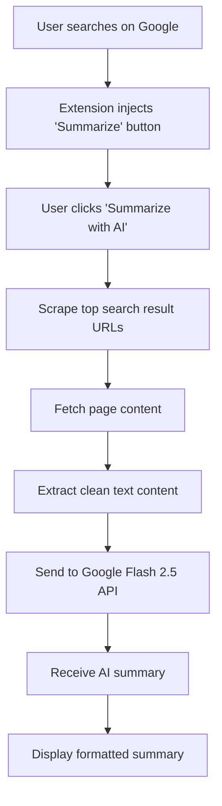

# Gist  🚀

> A dead-simple Chrome extension that enhances Google Search with AI-generated summaries using your own Google AI Flash 2.5 API key.

## 🎯 Project Overview

**Gist** transforms your Google search experience by providing instant AI-powered summaries of search results. Simply search on Google, click "Summarize with AI", and get a concise overview of the top results.

### ✅ Implementation Status

**COMPLETE** - All core features implemented and ready to use!

### ✨ Key Features

- 🔑 **Bring Your Own Key (BYOK)** - Use your own Google AI API key
- 🚀 **100% Client-Side** - No backend servers or external dependencies
- ⚡ **One-Click Operation** - Instant summaries with minimal setup
- 🎨 **Clean Interface** - Seamless integration with Google Search

## 🏗️ Architecture & Design

### Core Principles

- **Client-Side Only** - All processing happens in your browser
- **No External Services** - Completely self-contained
- **Minimal Permissions** - Only essential Chrome extension permissions
- **Simple Setup** - One API key entry and you're ready

### How It Works



## 📋 Technical Requirements

### Extension Structure

```
Gist/
├── manifest.json              # Extension configuration
├── popup/
│   ├── popup.html            # API key settings UI
│   └── popup.js              # Settings functionality
├── content/
│   ├── content.js            # Main search integration
│   └── content.css           # Summary overlay styles
└── lib/
    └── showdown.min.js       # Markdown rendering
```

### Manifest Configuration (manifest.json)

```json
{
  "manifest_version": 3,
  "name": "Gist",
  "version": "1.0",
  "description": "Summarizes Google search results using your Google Flash 2.5 API key.",
  "permissions": ["storage"],
  "host_permissions": ["<all_urls>"],
  "action": {
    "default_popup": "popup/popup.html"
  },
  "content_scripts": [
    {
      "matches": ["https://www.google.com/search*"],
      "js": ["lib/showdown.min.js", "content/content.js"],
      "css": ["content/content.css"]
    }
  ]
}
```

### API Integration

**Endpoint:** `https://generativelanguage.googleapis.com/v1beta/models/gemini-1.5-flash-latest:generateContent`

**Request Format:**
```json
{
  "contents": [
    {
      "parts": [
        { "text": "Summarize the following information concisely:\n\n{content}" }
      ]
    }
  ]
}
```

## 🚀 Implementation Guide

### Phase 1: Extension Setup

1. **Create Manifest**
   ```json
   {
     "manifest_version": 3,
     "name": "Gist",
     "version": "1.0",
     "description": "Summarizes Google search results using your Google Flash 2.5 API key.",
     "permissions": ["storage"],
     "host_permissions": ["<all_urls>"],
     "action": {
       "default_popup": "popup/popup.html"
     },
     "content_scripts": [
       {
         "matches": ["https://www.google.com/search*"],
         "js": ["lib/showdown.min.js", "content/content.js"],
         "css": ["content/content.css"]
       }
     ]
   }
   ```

### Phase 2: API Key Management

**HTML (popup/popup.html):**
```html
<input type="password" id="apiKey" placeholder="Enter Flash 2.5 API Key"/>
<button id="saveKey">Save Key</button>
```

**JavaScript (popup/popup.js):**
```javascript
document.getElementById('saveKey').addEventListener('click', () => {
    const key = document.getElementById('apiKey').value.trim();
    chrome.storage.local.set({ flashApiKey: key }, () => alert("API Key saved!"));
});

document.addEventListener('DOMContentLoaded', () => {
    chrome.storage.local.get('flashApiKey', ({ flashApiKey }) => {
        if (flashApiKey) document.getElementById('apiKey').value = flashApiKey;
    });
});
```

### Phase 3: Content Integration

The extension injects a "Summarize with AI" button into Google search results pages. When clicked, it:

1. **Scrapes URLs** from search results
2. **Fetches content** from each page
3. **Extracts text** (removes HTML, ads, navigation)
4. **Combines content** into a single text corpus
5. **Sends to API** with your configured key
6. **Displays summary** in a clean overlay

**Core Function (content/content.js):**
```javascript
function addSummarizeButton() {
    const btn = document.createElement('button');
    btn.innerText = "Summarize with AI";
    btn.className = "summarize-btn";
    btn.onclick = summarizeResults;
    document.body.appendChild(btn);
}

async function summarizeResults() {
    const { flashApiKey } = await chrome.storage.local.get('flashApiKey');
    if (!flashApiKey) return alert("Please enter your Flash 2.5 API Key in extension settings.");

    const urls = scrapeGoogleUrls();
    const pages = await Promise.all(urls.map(u => fetch(u).then(r => r.text()).catch(() => "")));
    const corpus = pages.map(cleanHtmlToText).join("\n\n");

    const prompt = `Summarize the following information concisely:\n\n${corpus}`;

    const res = await fetch(`https://generativelanguage.googleapis.com/v1beta/models/gemini-1.5-flash-latest:generateContent?key=${flashApiKey}`, {
        method: "POST",
        headers: { "Content-Type": "application/json" },
        body: JSON.stringify({ contents: [{ parts: [{ text: prompt }] }] })
    });

    const data = await res.json();
    const markdown = data.candidates[0].content.parts[0].text;
    displaySummary(markdown);
}

addSummarizeButton();
```

## 🎯 User Setup Flow

### Quick Start (3 Steps)

1. **Install Extension**
   - Open Chrome and navigate to `chrome://extensions/`
   - Enable "Developer mode" (toggle in top-right)
   - Click "Load unpacked" and select the `Gist` folder
   - The extension icon should appear in your toolbar

2. **Configure API Key**
   - Click the Gist extension icon in your browser toolbar
   - Enter your Google AI API key (get one from [Google AI Studio](https://aistudio.google.com/app/apikey))
   - Click "Save Key"
   - Key is stored securely in browser storage

3. **Start Summarizing**
   - Go to [Google](https://www.google.com) and search for anything
   - Look for the "✨ Summarize with AI" button in the top-right corner
   - Click it to get an instant AI-generated summary of the top 5 results
   - Close the summary overlay by clicking the X or clicking outside

### Example Usage

```bash
# After installation and setup:
1. Go to https://www.google.com
2. Search for "artificial intelligence trends 2024"
3. Click "✨ Summarize with AI" button (top-right)
4. Read the beautifully formatted AI summary
5. Click X or outside to close
```

## 🔧 Dependencies & Libraries

| Component | Purpose | Source |
|-----------|---------|--------|
| **Showdown.js** | Markdown to HTML rendering | CDN or local file |
| **Chrome Storage API** | Secure API key storage | Built-in browser API |
| **Fetch API** | Content retrieval and API calls | Built-in browser API |

## 📚 API Reference

### Core Functions

- `addSummarizeButton()` - Injects UI into search pages
- `summarizeResults()` - Orchestrates the summarization process
- `scrapeGoogleUrls()` - Extracts result URLs from SERP
- `cleanHtmlToText()` - Converts HTML to readable text
- `displaySummary()` - Shows formatted summary to user

### File Structure

| File | Purpose | Key Components |
|------|---------|----------------|
| `manifest.json` | Extension configuration | Permissions, content scripts |
| `popup/popup.html` | Settings interface | API key input form |
| `popup/popup.js` | Settings logic | Storage management |
| `content/content.js` | Main functionality | Search integration, API calls |
| `content/content.css` | Styling | Summary overlay design |
| `lib/showdown.min.js` | Markdown rendering | Text formatting |

## 🎨 Features Implemented

- ✅ Clean, modern UI with gradient button
- ✅ Beautiful modal overlay for summaries
- ✅ Markdown rendering with Showdown.js
- ✅ Loading states and error handling
- ✅ Scrapes top 5 non-YouTube results
- ✅ Extracts clean text (removes scripts, styles, nav)
- ✅ Secure API key storage
- ✅ Smooth animations and transitions

## 🤝 Contributing

This is a simple, focused implementation. For improvements:

1. Consider rate limiting for API calls
2. Add caching for frequently accessed content
3. Add customization options for summary style
4. Support for other search engines

## 📄 License

Open source - feel free to modify and distribute.

---

**Ready to revolutionize your search experience?** Install Gist and turn complex search results into clear, actionable insights with the power of AI.
