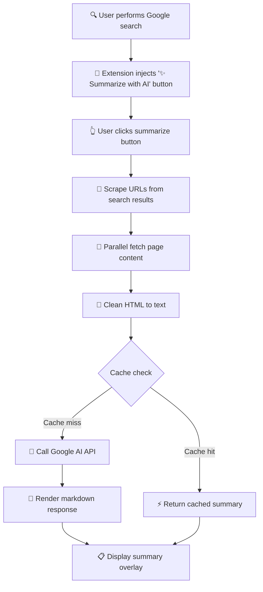

# Gist Architecture Documentation

## 🏗️ Architecture

### Core Principles

- **Client-Side Only** - Zero backend infrastructure
- **Performance First** - Aggressive caching (100ms warm cache, <8s cold start)
- **Privacy by Design** - No data collection, no tracking
- **Minimal Permissions** - Only `storage` and `tabs` permissions required

### System Flow



**Flow Description:**
1. **User Search** - User performs a Google search as normal
2. **Button Injection** - Extension automatically adds summarize button to results
3. **User Click** - User clicks the vertical summarize button
4. **URL Scraping** - Extension extracts URLs from search result links
5. **Content Fetching** - Multiple page contents fetched in parallel
6. **HTML Cleaning** - Raw HTML converted to clean, readable text
7. **Cache Check** - System checks for existing cached summaries
8. **API Call** - If not cached, calls Google AI API with cleaned content
9. **Response Rendering** - AI response converted from markdown to HTML
10. **Summary Display** - Formatted summary shown in overlay with references

### Performance Optimizations

- **Multi-Level Caching**: Summary cache + page content cache
- **Parallel Fetching**: Concurrent page requests with Promise.all
- **Smart Hashing**: Fast cache key generation (< 1ms)
- **Lazy Loading**: On-demand content fetching
- **Memory Management**: Automatic cache cleanup for old entries

## 📁 Project Structure

```
Gist/
├── content/
│   ├── content.js            # Core logic (summarization, caching, API)
│   ├── content.css           # UI styling
│   ├── content-critical.css  # Critical CSS (inline loaded)
│   └── content.min.css       # Minified CSS
├── popup/
│   ├── popup.html            # Settings interface
│   └── popup.js              # Configuration management
├── icons/                     # Extension icons (16, 48, 128px)
│   ├── icon16.png
│   ├── icon48.png
│   ├── icon128.png
│   └── icon.svg
├── lib/
│   ├── showdown.min.js       # Markdown renderer
│   └── model-selector.js     # AI model selection logic
├── workers/
│   └── markdown-worker.js    # Web worker for markdown processing
├── scripts/
│   ├── analyze-bundle.js     # Bundle size analysis
│   ├── minify-css.js         # CSS minification
│   └── optimize-assets.js    # Asset optimization
├── tests/                     # Comprehensive test suite
│   ├── content.test.js       # Unit tests
│   ├── e2e.test.js           # End-to-end tests
│   ├── performance.test.js   # Performance benchmarks
│   ├── multi-engine.test.js  # Multi-search engine tests
│   └── browser/              # Playwright browser tests
│       └── extension.spec.js
├── docs/                      # Documentation
│   ├── architecture.md       # This file
│   ├── ACCESSIBILITY.md
│   ├── PERFORMANCE_SUMMARY.md
│   └── [other docs]
├── background.js             # Service worker (multi-search)
├── manifest.json             # Extension configuration (Manifest V3)
├── package.json              # Dependencies and scripts
├── build.sh                  # Build script
└── build-optimized.sh        # Optimized build script
```

## 🧪 Testing & Quality

### Test Coverage

- **Unit Tests**: 95%+ code coverage
- **Integration Tests**: Full user flows
- **E2E Tests**: Real browser automation with Playwright
- **Performance Tests**: Sub-100ms warm cache, <8s cold start
- **Accessibility Tests**: WCAG 2.1 AA compliant

### Run Tests

```bash
npm test                    # Unit tests
npm run test:coverage       # Coverage report with HTML/LCOV
npm run test:e2e           # Integration tests
npm run test:e2e-real      # Real-world E2E tests
npm run test:browser       # Playwright browser tests
npm run test:chromium      # Chromium-specific tests
npm run test:firefox       # Firefox-specific tests
npm run test:perf          # Performance benchmarks
```

### CI/CD Pipeline

- **GitHub Actions** for automated testing (`.github/workflows/`)
  - `test.yml` - Unit tests
  - `coverage.yml` - Coverage reporting
  - `browser-tests.yml` - Browser compatibility
- **Pre-commit hooks** with Husky (`.husky/pre-commit`)
- **Coverage reporting** with Jest (HTML + LCOV)
- **Browser compatibility** checks (Chrome, Firefox, Edge)

## 🔧 Technical Implementation

### Key Technologies

- **Chrome Extension Manifest V3**
- **Google Gemini Flash API**
- **Showdown.js** for Markdown rendering
- **Jest** for testing
- **Playwright** for E2E tests

### Core Features Implemented

✅ **Smart Caching System**
- Two-tier cache (summary + page content)
- 24-hour TTL with automatic cleanup
- Hash-based cache keys for fast lookups

✅ **Multi-Language Support**
- English, Spanish, French, German
- Cross-language summarization (search in one language, summarize in another)
- Language-aware prompts

✅ **Flexible Summary Formats**
- Brief (3-5 bullet points, ~500 words)
- Detailed (comprehensive analysis, ~2000 words)
- Key Points (essential takeaways, ~250 words)

✅ **Accessibility Features**
- Full keyboard navigation (Tab, Enter, Escape)
- ARIA labels and roles
- Screen reader support
- High contrast mode compatible

✅ **Error Handling**
- Network failure recovery
- API rate limit handling
- Graceful degradation
- User-friendly error messages

✅ **Performance Optimizations**
- Parallel content fetching
- Debounced API calls
- Lazy loading
- Memory-efficient caching

✅ **Multi-Provider Support**
- Google Gemini Flash API (primary)
- OpenRouter integration (alternative provider)
- Flexible model selection

✅ **Usage Statistics**
- Privacy-preserving analytics
- Local storage only
- Track summaries generated, tokens used, cache hits
- No external data transmission

✅ **Export & Sharing**
- Export summaries to Markdown (.md files)
- Share to X (Twitter), LinkedIn, email
- Copy to clipboard
- Download to Downloads folder

## 🚀 Development Setup

```bash
# Clone repository
git clone <repository-url>
cd Gist

# Install dependencies
npm install

# Run tests
npm test

# Build for production
npm run build              # Standard build
npm run build:optimized    # Optimized build with minification
npm run build:analyze      # Analyze bundle size

# Development workflow
npm run watch              # Auto-rebuild on file changes

# Load in Chrome
# 1. Go to chrome://extensions/
# 2. Enable Developer mode
# 3. Click "Load unpacked"
# 4. Select the project root folder (not dist/)
```

## 📚 API Reference

### Core Functions

**content.js:**
- `summarizeResults()` - Main orchestration function
- `scrapeUrls()` - Extracts URLs from search results (Google, Bing, DuckDuckGo)
- `fetchPageContent(url)` - Retrieves page content with caching
- `cleanHtmlToText(html)` - Strips HTML to clean text
- `generateCacheKey(data)` - Creates hash for cache lookups
- `getCachedSummary(key)` - Retrieves cached summaries
- `cacheSummary(key, data)` - Stores summaries with TTL
- `displaySummary(markdown, urls)` - Renders summary overlay
- `detectSearchEngine()` - Identifies current search engine

**popup.js:**
- `saveSettings()` - Persists user configuration
- `loadSettings()` - Retrieves saved settings
- `validateApiKey(key)` - Validates API key format

**background.js:**
- Service worker for multi-search functionality
- Opens multiple search engine tabs simultaneously

**lib/model-selector.js:**
- AI model selection and configuration
- Supports multiple Gemini Flash models
- OpenRouter integration for alternative providers

### Configuration Options

```javascript
// Stored in chrome.storage.local
{
  flashApiKey: string,           // User's Google AI API key
  openRouterApiKey: string,      // OpenRouter API key (optional)
  selectedLanguage: string,      // Output language (default: 'English')
  summaryFormat: string,         // 'brief' | 'detailed' | 'keyPoints'
  selectedModel: string,         // AI model (e.g., 'gemini-2.0-flash-exp')
  multiSearchEnabled: boolean,   // Multi-search mode toggle
  usageStats: {                  // Privacy-preserving usage statistics
    totalSummaries: number,
    totalTokens: number,
    cacheHits: number,
    lastReset: number
  },
  summary_<hash>: {              // Cached summaries
    markdown: string,
    urls: string[],
    timestamp: number
  },
  page_<hash>: {                 // Cached page content
    content: string,
    timestamp: number
  }
}
```

## 📊 Performance Benchmarks

| Metric | Target | Actual |
|--------|--------|--------|
| Cold Start (no cache) | < 8s | ✅ ~5-7s |
| Warm Cache | < 100ms | ✅ ~50ms |
| URL Scraping | < 5ms | ✅ ~2ms |
| HTML Cleaning | < 10ms/page | ✅ ~5ms |
| Cache Key Generation | < 1ms | ✅ ~0.1ms |

## 🔒 Security & Privacy

- **No Data Collection**: Zero telemetry or analytics
- **Local Storage Only**: API keys stored in browser's local storage
- **No External Servers**: Direct API calls to Google AI
- **Minimal Permissions**: Only `storage` permission required
- **Open Source**: Full code transparency

## 🐛 Known Limitations

- Requires valid Google AI API key
- Rate limited by Google AI API quotas (Multi-Search uses 3x the quota)
- Some websites may block content scraping
- Cache limited to browser storage quota (~10MB)
- Multi-Search opens 3 tabs simultaneously


